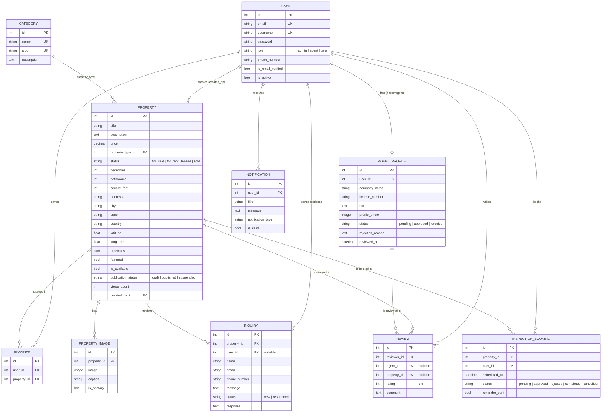

# ER Diagram

Paste the block below into any Mermaid viewer (GitHub renders it automatically, or use https://mermaid.live).

```mermaid
erDiagram
    USER ||--o| AGENT_PROFILE : "has (if role=agent)"
    USER ||--o{ PROPERTY : "creates (created_by)"
    USER ||--o{ FAVORITE : saves
    USER ||--o{ INQUIRY : "sends (optional)"
    USER ||--o{ INSPECTION_BOOKING : books
    USER ||--o{ REVIEW : writes
    USER ||--o{ NOTIFICATION : receives
    CATEGORY ||--o{ PROPERTY : "property_type"
    PROPERTY ||--o{ PROPERTY_IMAGE : has
    PROPERTY ||--o{ FAVORITE : "is saved in"
    PROPERTY ||--o{ INQUIRY : receives
    PROPERTY ||--o{ INSPECTION_BOOKING : "is booked in"
    PROPERTY ||--o{ REVIEW : "is reviewed in"
    AGENT_PROFILE ||--o{ REVIEW : "is reviewed in"

    USER {
        int id PK
        string email UK
        string username UK
        string password
        string role "admin | agent | user"
        string phone_number
        bool is_email_verified
        bool is_active
    }
    AGENT_PROFILE {
        int id PK
        int user_id FK
        string company_name
        string license_number
        text bio
        image profile_photo
        string status "pending | approved | rejected"
        text rejection_reason
        datetime reviewed_at
    }
    CATEGORY {
        int id PK
        string name UK
        string slug UK
        text description
    }
    PROPERTY {
        int id PK
        string title
        text description
        decimal price
        int property_type_id FK
        string status "for_sale | for_rent | leased | sold"
        int bedrooms
        int bathrooms
        int square_feet
        string address
        string city
        string state
        string country
        float latitude
        float longitude
        json amenities
        bool featured
        bool is_available
        string publication_status "draft | published | suspended"
        int views_count
        int created_by_id FK
    }
    PROPERTY_IMAGE {
        int id PK
        int property_id FK
        image image
        string caption
        bool is_primary
    }
    FAVORITE {
        int id PK
        int user_id FK
        int property_id FK
    }
    INQUIRY {
        int id PK
        int property_id FK
        int user_id FK "nullable"
        string name
        string email
        string phone_number
        text message
        string status "new | responded"
        text response
    }
    INSPECTION_BOOKING {
        int id PK
        int property_id FK
        int user_id FK
        datetime scheduled_at
        string status "pending | approved | rejected | completed | cancelled"
        bool reminder_sent
    }
    REVIEW {
        int id PK
        int reviewer_id FK
        int agent_id FK "nullable"
        int property_id FK "nullable"
        int rating "1-5"
        text comment
    }
    NOTIFICATION {
        int id PK
        int user_id FK
        string title
        text message
        string notification_type
        bool is_read
    }
```
